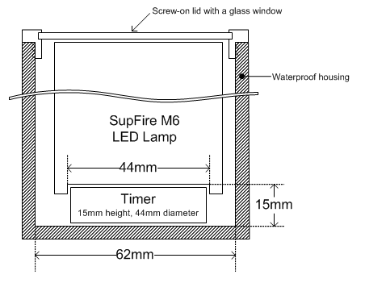
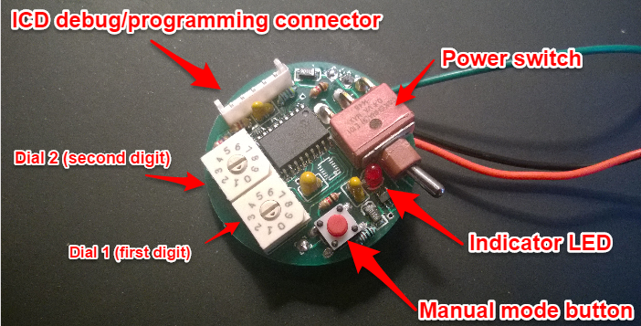
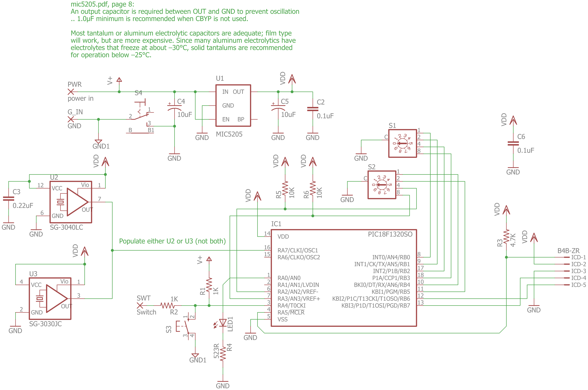
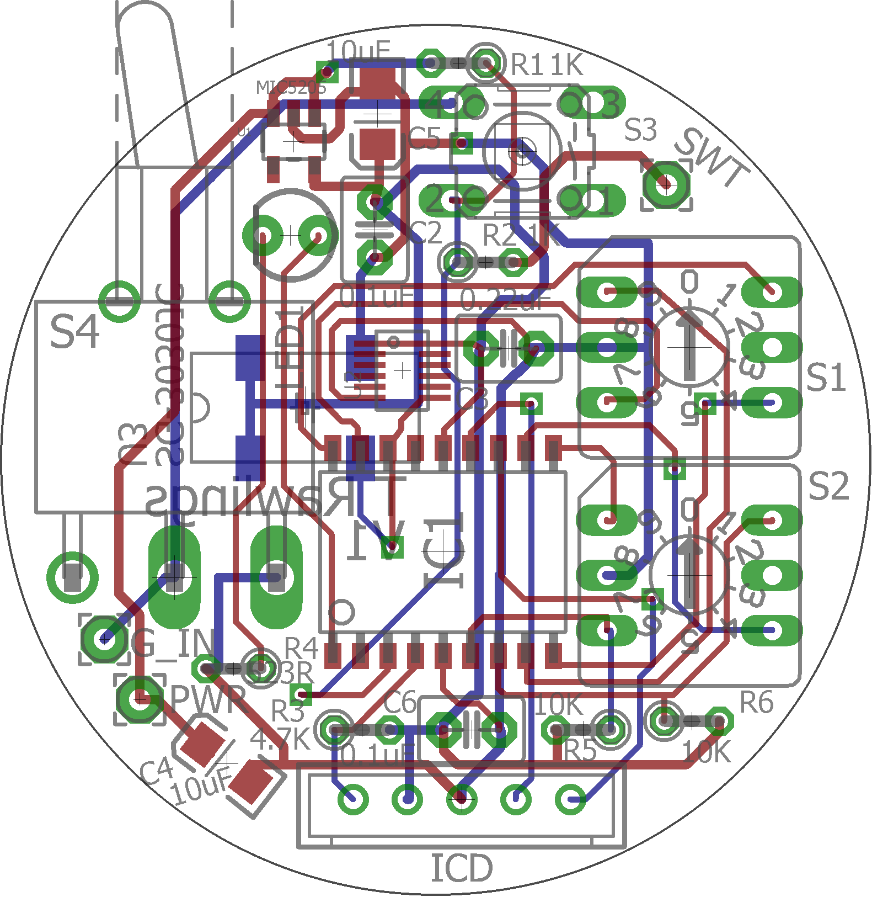
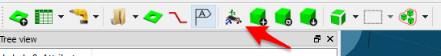

LED timer


# Design Overview
## Mechanical

To fit within the waterproof housing the timer is limited to a 44mm diameter cylinder of height 15mm.



The case has been designed using [freeCad](https://www.freecadweb.org/) see the [Configuring FreeCad](#configuring-freecad) 
section below for help setting it up. 

The design files are in the `freeCad` subdirectory and the finished designs have been 
uploaded to sculpteo ([sculpteo/case2-66](https://www.sculpteo.com/en/print/case2-66/AvhQv5jK) and [sculpteo/bottom-1007](https://www.sculpteo.com/en/print/bottom-1007/qzUkbDYg)).

## Electrical

The unit has a single 2 layer, 40mm diameter PCB.

<a href="buttons.png"></a>

The electrical design files are in the `./eagle` subfolder. The majority of the components have been sourced from [digiKey](http://www.digikey.com/). See [bill\_of\_materials.xlsx](bill_of_materials.xlsx) for details.

<a href="schematic.png"></a>
<a href="pcb.png"></a>

### PCB Manufacture
The circuit boards have been manufactured using [PCBWay](http://www.pcbway.com/).  The steps required to gerber files required by PCBWay are documented in [a blog post](cam_processor/How to generate Gerber from Eagle-SOFTWARE - Share- Hacker - PCBWay.pdf)

TODO: Create a grunt task that automates the process.

Once the .zip archive containing the gerber files has been generated it needs to be uploaded to PCBWay.  The parameters used when submitting an order are [here](cam_processor/pcbway_order_parameters.pdf).

## Software

Software is in the `mplab\LED.X` subfolder.  

#Tools

1. [Cadsoft Eagle PCB Design](https://cadsoft.io/)

   To use the Grunt task the eagle binary will need to be in the [system path](http://www.computerhope.com/issues/ch000549.htm).  For me that meant adding `C:\EAGLE-7.6.0\bin` to the path.
   
1. [Microchip MPLAB X Integrated Development Envrionment (IDE)](http://www.microchip.com/mplab/mplab-x-ide)

1. [MPLAB ICD 3 In-Circuit Debugger](http://www.microchip.com/Developmenttools/ProductDetails.aspx?PartNO=DV164035)

1. [FreeCAD](http://www.freecadweb.org/)
1. [eaglepcb2freecad](https://sourceforge.net/projects/eaglepcb2freecad/?source=typ_redirect)

   A FreeCAD plugin that can import the PCB design from eagle and generate a 3D represenation of the PCB.
      1. Download the [FreeCAD plugin]( https://sourceforge.net/projects/eaglepcb2freecad/?source=typ_redirect)
      1. The .7zachive will need to be extracted. I used the linux tool [dtrx](https://brettcsmith.org/2007/dtrx/)
      1. Follow the instructions within the archive to install the plugin
	  1. eaglepcb2freecad's parts library will need to be configured.  See the [Configuring FreeCAD](#configuring-freecad) section below.

1. [Nodejs](https://nodejs.org/en/)
   Used to download the 3D CAD model libraries used by FreeCAD. 
   
   Download and run the installer. Then at the command prompt:
   ```
   npm install
   ```

2. [Grunt](http://gruntjs.com/getting-started#installing-the-cli)

   Used to automate some tasks.
   
   ```
   npm install -g grunt-cli
   ```

# Configuring FreeCAD

1. Configure eaglepcb2freecad. Open freeCAD and then from the top menu go Edit > Preferences.  In the window the opens select 'PCB' from the list on the left

  * Set the default board thickness to 1.6mm
  * Set the Parts:Paths to include the location of the [freecad_eagle_models](https://github.com/TrevorRawlings/freecad_eagle_models) and [electrical_components](https://github.com/TrevorRawlings/electrical_components) git repositories.  If you have run a `npm install` then two git repos will have been cloned into the node_modules subdirectory:
  
    <project_folder>\node_modules\electrical_components,
	<project_folder>\node_modules\freecad_eagle_models\models_1,
	<project_folder>\node_modules\freecad_eagle_models\models_2,
	<project_folder>\node_modules\freecad_eagle_models\models_3,
	<project_folder>\node_modules\freecad_eagle_models\models_4,
	
  * Import the parts database `eagle2FreecadPartsDb\freecad-pcb_copy.fpcb`
  
    Select 'Printed Circuit Board' `View > Workbench` menu and then click the Assign Models button on the PCB Settings tool bar (see the image below)
	
	
	
	In the window that openc click 'Import Database' from the menu on the left.
    	E:\projects\ALFA_LED\node_modules\electrical_components,E:\projects\ALFA_LED\node_modules\freecad_eagle_models\models_1,E:\projects\ALFA_LED\node_modules\freecad_eagle_models\models_2,E:\projects\ALFA_LED\node_modules\freecad_eagle_models\models_3,E:\projects\ALFA_LED\node_modules\freecad_eagle_models\models_4
	
	
	E:\freeCadModels\models_1,E:\freeCadModels\models_2,E:\freeCadModels\models_3,E:\freeCadModels\models_4,E:\freeCadModels\custom
	

